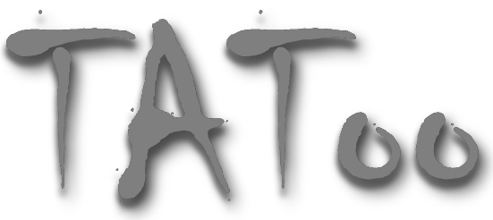
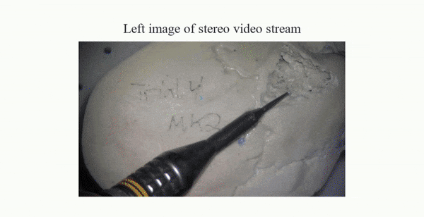

<div align="center">

</div>

<hr>

This is the official repo for our work [TAToo: Vision-based Joint Tracking of Anatomy and Tool for Skull-base Surgery](https://arxiv.org/abs/2212.14131). 



# Abstract
 (*T*racker for *A*natomy and *Too*l) jointly tracks the rigid 3D motion of the patient skull and surgical drill from stereo microscopic videos. 
 leverages low-level vision signals and estimates motion via an iterative optimization process in an end-to-end differentiable form. For robust tracking performance,  adopts a probabilistic formulation and enforces geometric constraints on the object level.

# Updates
- June 2nd, 2023: We have added support of [CRESTereo](https://github.com/ibaiGorordo/CREStereo-Pytorch)! See [configs/models/tatoo.py](configs/models/tatoo.py) for more details.
- May 20th, 2023: We have deprecated the virutal dense data + real optical tracking data training scheme described in the paper. Instead, we use the [digital twin paradigm](https://arxiv.org/abs/2211.11863) to generate real dense data.

# Environment setup
We have provided a [docker file](Dockerfile) for building docker environments. You may need to use `sudo` if your docker is not set up for all users.

Build the docker image
```
cd PATH_TO/TAToo
docker build -t tatoo .
```

Create a docker container
```
docker run -it --name tatoo_container --gpus=all --ipc=host -v PATH_TO/TAToo:/workspace/PATH_TO/TAToo
```

Start an interactive shell
```
docker exec -it tatoo_container bash
```

# Pretrained weights download
TAToo pretrained on Twin-S can be downloaded from [this link](https://drive.google.com/file/d/1k6BrwTXxfk6RN9Rsm0myCxJNMRA38G3e/view?usp=sharing).

# Inference
Use the following to run inference on stereo images
```bash
python scripts/inference_on_images.py --left PATTERN_LEFT --right PATTERN_RIGHT --ckpt PATH_TO_CHECKPOINT
```

To visualize the results, use the following:
```bash
python scripts/visualize_output.py --video_write_dir PATH_TO_VIDEO_DIR --data_dir PATH_TO_OUTPUT --seg --flow --disp
```
# Training
## Data
We use [HDF5 file](https://docs.h5py.org/en/stable/) to store data. The HDF5 contains the following groups:
```
metadata
|__ README
|__ T_cb_c: calibrated transformation from camera base (cb) to camera (c)
|__ T_db_d: calibrated transformation from drill base (db) to drill (d)
|__ T_pb_p: calibrated transformation from phantom base (pb) to phantom (p)
|__ baseline: camera baseline
|__ camera_extrinsic: extrinsics to convert to OpenCV convention
|__ camera_extrinsic: 3x3 intrinsics matrix

data
|__ l_img: left image
|__ r_img: right image
|__ time: time of acquisition
|__ segm: segmentation
|__ depth: depth
|__ pose_camhand: camera base pose
|__ pose_drill: drill base pose
|__ pose_pan: phantom base pose
```
 
### Sample data
The data can be downloaded from google drive from [this link](https://drive.google.com/drive/folders/1NOAYeb9HPq3eaDrAgAlgbsfobmPXijIO?usp=sharing).

To visualize the sample data, you can use the following script
```bash
python scripts/visualize_hdf5.py --base_folder PATH_TO_DATA --hdf5_file PATH_TO_HDF5
```

Alternatively, you can use a split file
```bash
python scripts/visualize_hdf5.py --base_folder PATH_TO_DATA --split_file PATH_TO_SPLIT_FILE
```

### Split files
Split files can be generated using the following
```bash
python scripts/generate_split.py --base_folder PATH_TO_HDF5_FOLDER --split_file SPLIT_FILE_NAME
```

Additionally, pose augmentation via sampling and reversing the video can be done with the `--resampling` and `--reverse_order` arguments.

## Launch training
Modify `configs/train_config.py` for [schedule config](configs/schedules/).

Run the following command
  - Distributed
      ```angular2html
      ./scripts/train.sh configs/train_config.py --work-dir PATH_TO_LOG [optional arguments]
      ```
  - Single GPU
    ```angular2html
    python train.py configs/train_config.py --work-dir PATH_TO_LOG [optional arguments]
    ```
- To freeze individual models, use `--freeze_stereo`, `--freeze_segmentation` or `--freeze_motion`

### Evaluation
Run following command
  - Distributed
      ```angular2html
      ./scripts/inference.sh configs/inference_config.py CHECKPOINT_PATH --eval [optional arguments]
      ```
  - Single GPU
      ```angular2html
      python inference.py configs/inference_config.py CHECKPOINT_PATH --eval [optional arguments]
      ```

Evaluation can be done on partial data via the `--num-frames` argument by specifying the number of frames to inference on, `-1` for all frames.

### Storing outputs for visualization
Run following command
  - Distributed
      ```angular2html
      ./scripts/inference.sh configs/inference_config.py CHECKPOINT_PATH --show [optional arguments]
      ```
  - Single GPU
      ```angular2html
      python inference.py configs/inference_config.py CHECKPOINT_PATH --show [optional arguments]
      ```

To visualize the results, use the following:
```bash
python scripts/visualize_output.py --video_write_dir PATH_TO_VIDEO_DIR --data_dir PATH_TO_OUTPUT --seg --flow --disp
```

## Acknowledgements
<span style = 'font-family:Chiller; font-size: 24px'>TAToo </span> is built upon the following great open-sourced projects
- [CODD](https://github.com/facebookresearch/CODD)
- [lietorch](https://github.com/princeton-vl/lietorch)
- [LinkNet](https://github.com/ternaus/robot-surgery-segmentation)
- [CREStereo](https://github.com/ibaiGorordo/CREStereo-Pytorch)


## Citation

If you find our work relevant, please cite
```
@article{li2023tatoo,
  title={Tatoo: vision-based joint tracking of anatomy and tool for skull-base surgery},
  author={Li, Zhaoshuo and Shu, Hongchao and Liang, Ruixing and Goodridge, Anna and Sahu, Manish and Creighton, Francis X and Taylor, Russell H and Unberath, Mathias},
  journal={International Journal of Computer Assisted Radiology and Surgery},
  pages={1--8},
  year={2023},
  publisher={Springer}
}
```